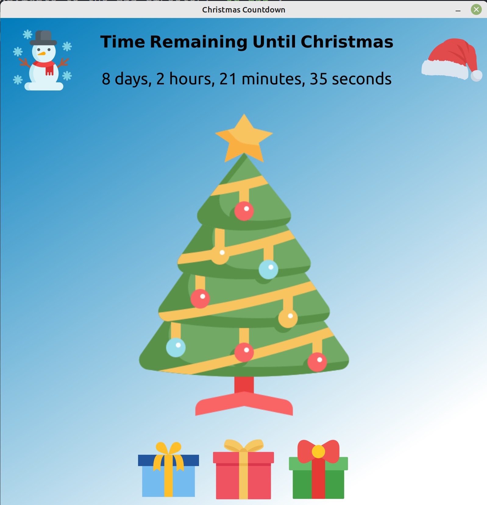

## It's beginning to look a lot like Christmas!

1. Clone Repo: `https://github.com/OceanTrader1/christmas_countdown.git`
2. Install Dependencies: `poetry install` or `pip install -r requirements.txt`
3. Navigate to the app directory `cd app`.
4. Run the countdown timer: `python app.py`
5. Wait till Christmas!

